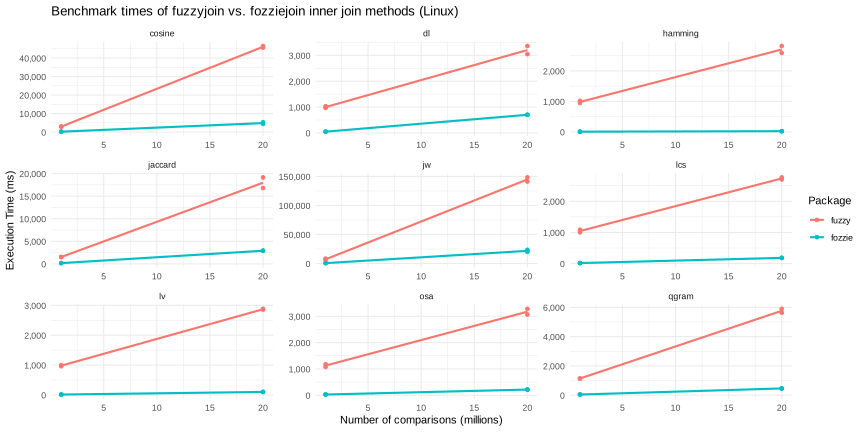

# fozziejoin: Performant data frame joins with inexact matching

[NOTE]: This project is in early development. APIs may change in the future. It currently depends on the Rust toolchain to install.

The `fozziejoin` package uses Rust to perform R dataframe joins based on string distance metrics.
It is intended to be a high-performance alternative to `stringdist_inner_join` and similar functions from the [fuzzyjoin package](https://github.com/dgrtwo/fuzzyjoin).

The `fuzzyjoin` package depends on the [`stringdist` package](https://github.com/markvanderloo/stringdist) for string distance-based joins.
While the `stringdist` package is very performant and multithreaded, it is not tailored to this use case.
In `fozziejoin`, everything is adapted to the case of fuzzy joins to eliminate unnecessary steps and memory copying.
Some examples:

- No duplicate string distance calculations are performed. You only need compare "Jon" and "John" once.
- No intermediate R objects, such as a matrix of string distance lengths, are created. All calculations are done in Rust and returned to R via the [`extendr` Rust crate](https://github.com/extendr/extendr).

The name itself is a bit of wordplay: the common term for this task is 'fuzzy join', which is similar to [Fozzie Bear](https://en.wikipedia.org/wiki/Fozzie_Bear) from the Muppets. 
A picture of Fozzie will be in the repo once a stronger legal team is in place.
Wocka wocka!

## Getting started

Code has been written on a combination of Windows (R 4.3.2, x86_64-w64-mingw32/64) and Linux (R 4.5.0, x86-64-pc-linux-gnu platform).
All builds to date are done using Rust 1.65. 

### Prerequisites

- R (version 4.5.0 preferred)
- The rust toolchain (`rustup`) and package manager (`cargo`)
- The `rextendr` R package
- The `devtools` R package
- The following R packages are required to run examples and benchmark scripts:
    - `dplyr`
    - `fuzzyjoin`
    - `qdapDictionaries`
    - `microbenchmark`

### Installation

First, clone the repo:

```{sh}
git clone https://github.com/JonDDowns/fozziejoin
cd ./fozziejoin
```

Then, use `devtools` to install the package.
Note that this requires the Rust toolchain and `cargo` to run properly.

```{R}
devtools::install()
```

Alternatively, use `devtools::load_all()` to load the package in development mode.

### Usage

Code herein is adapted from the motivating example used in the `fuzzyjoin` package.
First, we take a list of common misspellings (and their corrected alternatives) from Wikipedia.
To run in a a reasonable amount of time, we take a random sample of 1000.

```{r}
library(dplyr)
library(fozziejoin)
library(fuzzyjoin) # For misspellings dataset

# Load misspelling data
data(misspellings)

# Take subset of 1k records
set.seed(2016)
sub_misspellings <- misspellings %>%
  sample_n(1000)
```

Next, we load a dictionary of words from the `qdapDictionaries` package.

```{r}
# Use the dictionary of words from the qdapDictionaries package,
# which is based on the Nettalk corpus.
library(qdapDictionaries)
words <- tibble::as_tibble(DICTIONARY)
```

Then, we run our join function.

```{r}
# Run each function multiple times and compare results
fozzie <- fozzie_join(
    sub_misspellings, words, method='lv', by = c('misspelling', 'word'), max_distance=2
)
```

## Benchmarks

To date, `fozziejoin` has been benchmarked on Windows and Linux.
`fozziejoin` beats the equivalent `fuzzyjoin` benchmark in all cases except one: Damerau-Levenshtein (method `dl`) distance joins on Windows with large dataframes.
The highest observed performance gains come from Linux systems, presumably due to the relative efficiency of parallelization via `rayon`.

[](./benchmarks/benchmark_plot_Linux.svg)

[](./benchmarks/benchmark_plot_Windows.svg)

## Known behavior changes relative to `fuzzyjoin`

- Matching on columns with `NA` values would throw an error in `fuzzyjoin` but simply do not match in `fozziejoin`. This allows for NA values to persist in left, right, and full joins without matching all NA values to one another.
- Jaro-Winkler distance
    - The prefix scaling factor (`max_prefix`) is an integer representing a fixed number of characters. The analagous `stringdist` parameter, `bt`, was a proportion of string length.
- `fozziejoin` always assigns the suffix ".x" to columns from the LHS and ".y" to columns from the RHS. `fuzzyjoin` only does this when both LHS and RHS contain the same column name. `fozziejoin` may conform to the `fuzzyjoin` behavior in the future.

## Acknowledgements

- The `textdistance` crate for most string distance implementations. Currently, this crate is still used for some string distances. Others are based on `textdistance` implementations but with some performance tweaking for this use case.
- The `fuzzyjoin` and `stringdist` packages in R. Much of the project is meant to replicate their APIs and special cases handling.
- The `extendr` team. This project would not be possible without their great project.
